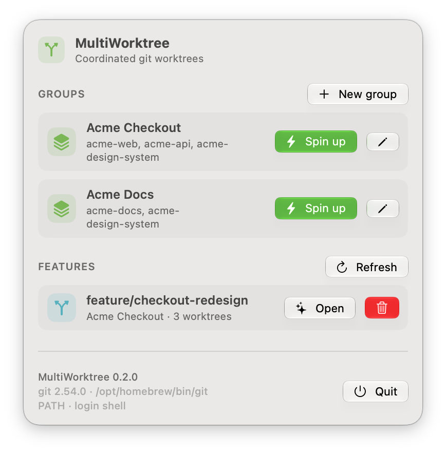
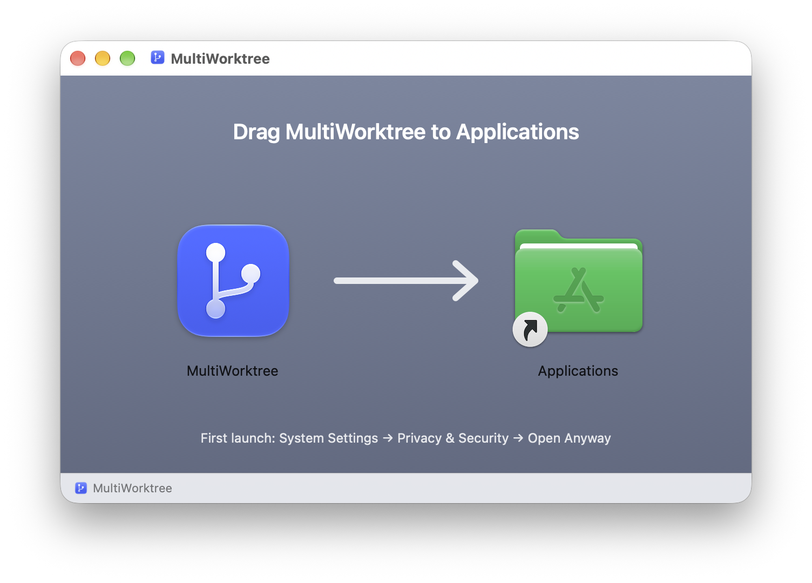
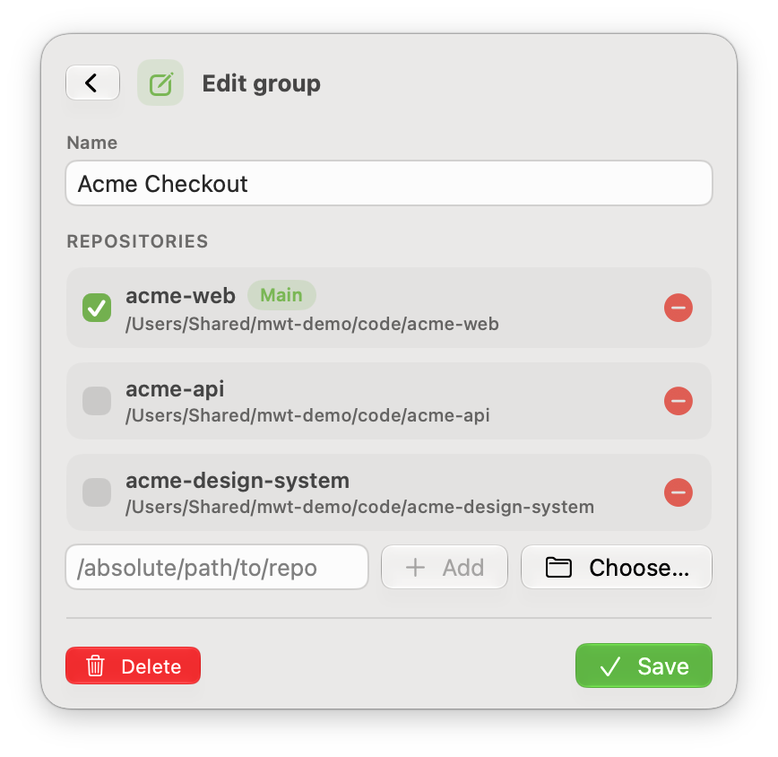
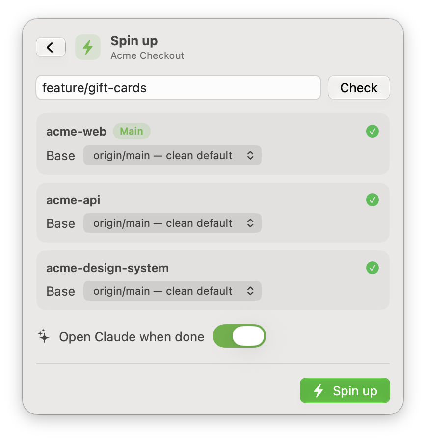
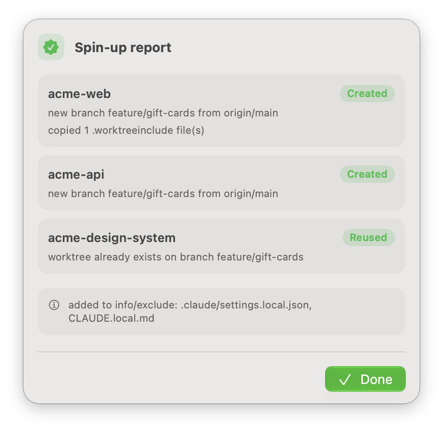
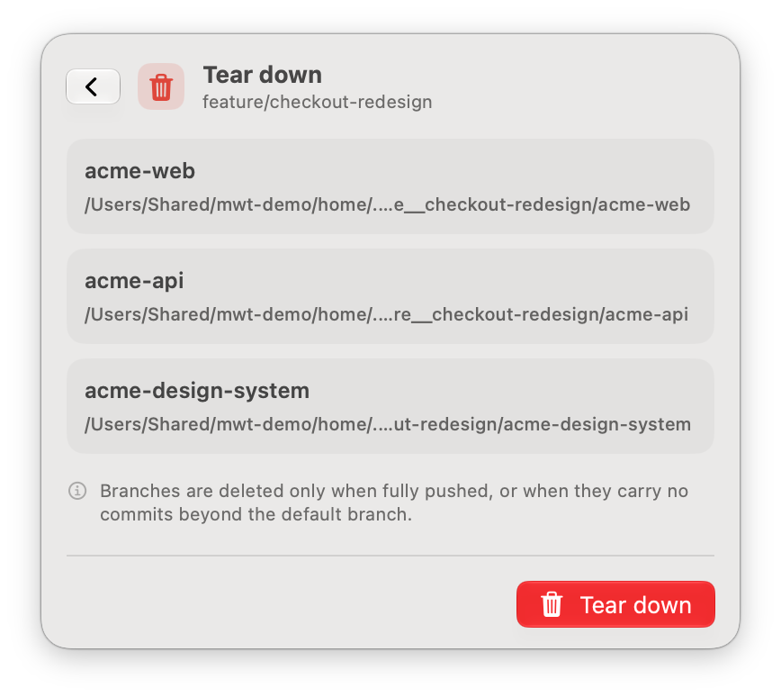
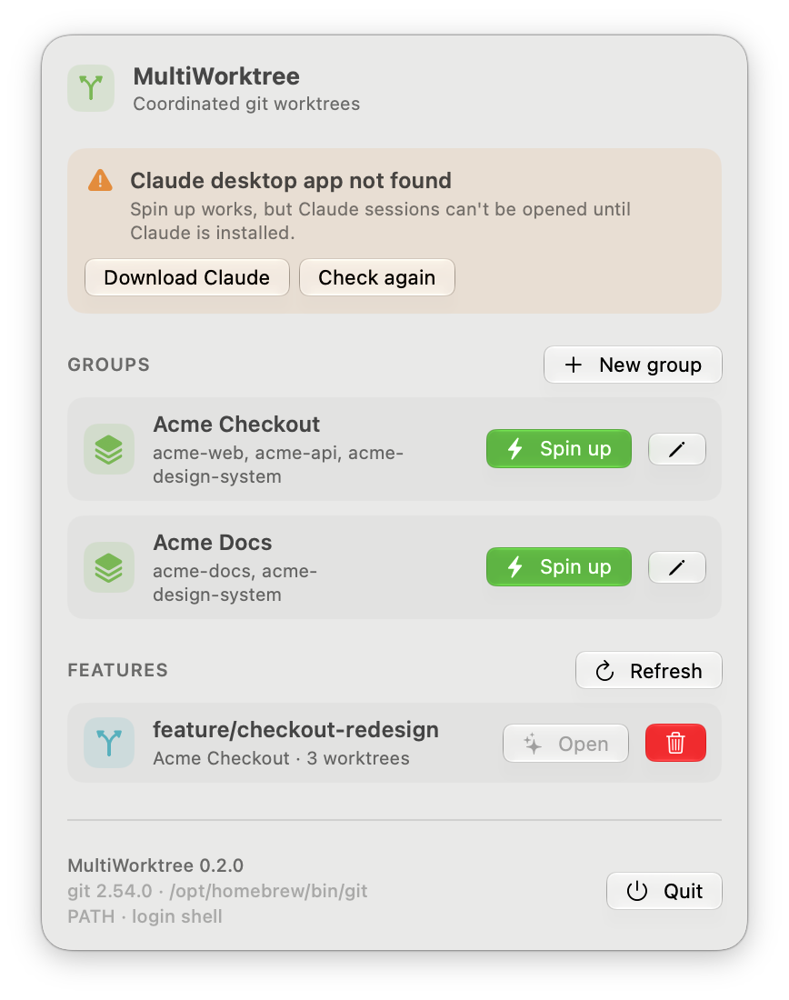

<p align="center">
  
</p>

<h1 align="center">MultiWorktree</h1>

<p align="center">
  Coordinated git worktrees across several repositories, opened as one Claude Code session.
</p>

<p align="center">
  
  
  
</p>

<p align="center">
  <picture>
    <source media="(prefers-color-scheme: dark)" srcset="docs/images/home-dark.png">
    
  </picture>
</p>

## Why

`git worktree` isolates one repository. A real feature often spans several: a web app, an API and a
shared design system. In Claude Code, sibling repositories added as additional working directories
are not worktree-isolated, so two features developed in parallel end up editing the same checkout of
every sibling repository.

MultiWorktree is a menu-bar app that, for a named group of repositories:

- creates a worktree on the same feature branch in every repository of the group;
- wires the main repository's worktree so that one Claude Code session sees the sibling
  **worktrees** and is denied the sibling **originals**;
- carries gitignored local files such as `.env` into the new worktrees;
- opens a new Claude session page in the main worktree;
- later tears everything down and deletes only the branches that are safe to delete.

## Features

- **Groups**: reusable sets of repositories with one main repository.
- **Pre-flight** per repository: remote and default-branch detection, fetch, a choice of base (the
  clean `origin/<default>` or your current local branch), and notices for existing branches and
  uncommitted work.
- **One branch name everywhere**: an existing local branch is reused, an existing remote branch is
  tracked, otherwise a new branch is created without tracking.
- **Claude wiring** in the main worktree: `.claude/settings.local.json` gets
  `permissions.additionalDirectories` for the sibling worktrees and `Read`/`Edit` deny rules for the
  sibling originals, and `CLAUDE.local.md` describes the layout. Both files are git-excluded.
- **`.worktreeinclude`**: gitignored files matching the patterns in a repository's
  `.worktreeinclude` are copied into its new worktree (the same rule Claude Code uses).
- **Re-runnable**: spinning up the same feature again reuses healthy worktrees and rewires.
- **Safe tear-down**: dirty worktrees are kept unless you confirm; branches are deleted only when
  fully pushed or when they carry no commits beyond the default branch.
- **Dependency check** at launch for git, the Command Line Tools and the Claude app, with fixes.
- **Update notice**: a banner when a newer release is published on GitHub (see
  [Updates and network](#updates-and-network)).

## Requirements

- A Mac running macOS 26 or newer, Apple Silicon or Intel (universal app).
- git 2.31 or newer: Apple's Command Line Tools (`xcode-select --install`) or Homebrew
  (`brew install git`).
- The [Claude desktop app](https://claude.com/download) to open sessions. Spin-up and tear-down work
  without it.

## Install

### From the DMG

1. Download `MultiWorktree-<version>.dmg` from the
   [latest release](https://github.com/kromuch/multi-worktree/releases/latest).
2. Open it and drag **MultiWorktree** to **Applications**.

   

3. Allow the first launch. MultiWorktree is ad-hoc signed and not notarized by Apple, so macOS
   blocks it once:
   1. Open MultiWorktree from Applications. macOS says it could not verify the app; click **Done**.
   2. Open **System Settings → Privacy & Security**, scroll to **Security** and click
      **Open Anyway** next to the MultiWorktree message. The button is shown for about an hour after
      the blocked attempt; if it is missing, open MultiWorktree again and come back.
   3. Confirm with your password or Touch ID.

   Or, in Terminal: `xattr -dr com.apple.quarantine /Applications/MultiWorktree.app`.
   You do this once per downloaded version.
4. MultiWorktree lives in the menu bar (branch icon) and has no Dock icon. If you don't see the icon,
   see [Troubleshooting](#troubleshooting). To start it at login, add it in
   **System Settings → General → Login Items & Extensions**.

Each release also has `MultiWorktree-<version>.dmg.sha256`. Put both files in one folder and run
`shasum -a 256 -c MultiWorktree-<version>.dmg.sha256`.

### Build from source

Needs Xcode 27 or newer (Swift 6.4 and `actool`), selected with
`sudo xcode-select -s /Applications/Xcode.app`.

```bash
git clone https://github.com/kromuch/multi-worktree.git
cd multi-worktree
./app/scripts/build-app.sh --install
```

The script builds a release bundle, installs it to `/Applications` and starts it. An app built on
your own Mac is not quarantined, so there is no Gatekeeper prompt. To update, `git pull` and run the
script again.

## Usage

### 1. Create a group

Click the menu-bar icon, then **New group**. Add repositories by path or with **Choose…**, and tick
the main one: the repository whose worktree the Claude session opens in. Repositories in a group must
have different folder names.

<picture>
  <source media="(prefers-color-scheme: dark)" srcset="docs/images/edit-group-dark.png">
  
</picture>

### 2. Spin up a feature

Click **Spin up** on a group, type the feature name and press **Check**. The name becomes the branch
name in every repository; `/` is allowed, for example `feature/gift-cards`. Each repository shows its
pre-flight result and base choice. Press **Spin up**.

<picture>
  <source media="(prefers-color-scheme: dark)" srcset="docs/images/spin-up-dark.png">
  
</picture>

Worktrees are created in `~/.mwt/trees/<feature>/<repository>`, with `/` in the feature name
replaced by `__`.

### 3. Work in Claude

The report lists each repository's outcome (created, reused, warned or failed) and notes. With
**Open Claude when done** on, Claude's new-session page opens in the main worktree; accept the folder
trust dialog the first time. The sibling worktrees appear as additional working directories.

If a sibling failed, Claude is not opened automatically. Fix the cause and spin up again (healthy
worktrees are reused), or click **Open Claude anyway**.

<picture>
  <source media="(prefers-color-scheme: dark)" srcset="docs/images/report-dark.png">
  
</picture>

### 4. Tear down

The trash button next to a feature opens the tear-down screen. A worktree with uncommitted changes is
kept and marked; tick **Discard changes and remove** and tear down again to remove it anyway. A branch
is deleted only when it is fully pushed or when all its commits are already on the default branch;
otherwise it is kept and reported. Claude tabs stay open.

<picture>
  <source media="(prefers-color-scheme: dark)" srcset="docs/images/tear-down-dark.png">
  
</picture>

## What it writes

| Path | Content |
|---|---|
| `~/.mwt/groups.json` | Your groups |
| `~/.mwt/features/<feature>.json` | One manifest per spun-up feature, used by tear-down |
| `~/.mwt/trees/<feature>/<repository>/` | The worktrees |
| `<main worktree>/.claude/settings.local.json` | `permissions.additionalDirectories` and `permissions.deny`, merged with what is already there |
| `<main worktree>/CLAUDE.local.md` | Session rules: which worktrees to edit and which originals not to touch |
| `<main repository>/.git/info/exclude` | Adds the two files above so they are never committed |

MultiWorktree reads `~/.claude.json` only to warn about local-scope MCP servers. It never writes to
`~/.claude.json` or `~/.claude/projects`. The deny rules are best-effort: they cover Claude's file
tools and common shell file commands, not every possible shell command.

## Troubleshooting

**The menu-bar icon doesn't appear.** Check that MultiWorktree is allowed in
**System Settings → Menu Bar**. On a MacBook with a notch, a crowded menu bar can hide icons behind
the notch: quit a few menu-bar apps or remove other icons with ⌘-drag.

**"post-checkout hook failed" in the report.** The worktree was created, but the repository's
`post-checkout` hook exited with an error. MultiWorktree runs git with your login shell's PATH, so
hooks usually find their tools. If a hook needs something only your interactive terminal sets up,
make the hook load it. With husky, put your version manager's setup in `~/.config/husky/init.sh`:

```sh
export NVM_DIR="$HOME/.nvm"
. "$NVM_DIR/nvm.sh"
```

**"Couldn't read PATH from your login shell".** At launch MultiWorktree runs your login shell once
with `MWT_RESOLVING_PATH=1` set and a 5-second limit. If your startup files are slow or wait for
input, skip that part when the variable is set:

```sh
if [ -z "$MWT_RESOLVING_PATH" ]; then
  source ~/.zsh/slow-plugins.zsh
fi
```

Until then the footer shows `PATH · fallback`; git itself keeps working with Homebrew and system
tools. Click **Check again** after changing your startup files.

**"Command Line Tools required".** `/usr/bin/git` is only a stub until Apple's Command Line Tools are
installed. Click **Install Command Line Tools** (or run `xcode-select --install`), then
**Check again**. Installing git with Homebrew works too.

**"git … is too old".** MultiWorktree needs git 2.31 or newer. Run `brew install git`, then
**Check again**.

**"Claude desktop app not found".** Install it from [claude.com/download](https://claude.com/download)
and click **Check again**. Spin-up and tear-down keep working in the meantime.

<picture>
  <source media="(prefers-color-scheme: dark)" srcset="docs/images/banner-dark.png">
  
</picture>

**macOS asks for access to Documents, Desktop or Downloads.** Repositories in those folders need it.
Because the app is ad-hoc signed, macOS may ask again after an update.

**MCP servers are missing in the worktree session.** Local-scope MCP servers are stored per folder in
`~/.claude.json`, so the worktree does not inherit them; the report warns about it. Move them to a
project-scope `.mcp.json`.

**macOS blocks the app after an update.** Every downloaded version needs **Open Anyway** once (see
[Install](#from-the-dmg)).

## Updates and network

Once at launch and then once a day, MultiWorktree asks GitHub's public API for the latest release
(`api.github.com/repos/kromuch/multi-worktree/releases/latest`). GitHub sees your IP address and the
app version in the request's User-Agent; nothing else is sent, and this is the only network request
the app makes. When a newer version exists, a banner offers **Download** (opens the release page),
**Later** (hides it until the next check) and **Skip this version**.

To update, download the new DMG, drag MultiWorktree to Applications (replacing the old copy) and
allow the first launch again as described in [Install](#from-the-dmg).

To turn the check off, run this, then quit and reopen MultiWorktree:

```sh
defaults write dev.kromuch.MultiWorktree checkForUpdates -bool false
```

Turn it back on with `defaults delete dev.kromuch.MultiWorktree checkForUpdates`.

## Uninstall

1. Tear down your features; this removes the worktrees and the safe-to-delete branches.
2. Quit MultiWorktree from its menu and delete `/Applications/MultiWorktree.app`.
3. Optionally delete `~/.mwt` and the app's settings (`defaults delete dev.kromuch.MultiWorktree`).
   The entries left in `.git/info/exclude` are harmless.

## Development

```bash
git config core.hooksPath .githooks
swift test --package-path app
./app/scripts/build-app.sh --open
```

The pre-commit hook requires one version bump for everything that is not yet on `main`. If it
rejects a commit, run `app/scripts/bump-version.sh` (or pass `minor` / `major`), then
`git add app/Sources/MWTKit/KitInfo.swift` and commit again. Releases follow
[docs/RELEASING.md](docs/RELEASING.md).

## License

[AGPL-3.0](LICENSE).

MultiWorktree is an independent project and is not affiliated with or endorsed by Anthropic.
Claude is a trademark of Anthropic.
